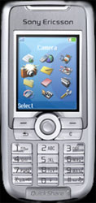

Sony Ericsson K700i
===================

Eager to have a mobile PIM in my pocket once again, and inspired by
[SVG-T](http://svg.org/special/svg_phones) and
[Bluetooth](http://www.apple.com/bluetooth/) I have purchased the [Sony
Ericsson
K700i](http://developer.sonyericsson.com/site/global/products/phones/k700/p_k700.jsp).

It works fabulously with my Apple Powerbook. I\'m able to synchronise my
calendar and address book over Bluetooth, with only a [few
bugs](http://www.esato.com/board/viewtopic.php?topic=61888&start=45#post859904)
that are being worked out. I can use the phone as a [remote
control](http://homepage.mac.com/jonassalling/Shareware/RemoteBasics/)
for various applications which is proving to be very useful. And bravo
to Ericsson for using an [open
standard](http://the.taoofmac.com/space/SonyEricsson/HID%20Profiles) for
putting together custom HID plugins. Lastly, Quicktime has a built-in
export profile for 3G media files so getting video and audio in a
size-appropriate format is a three-click maneuver.

The little J2ME interpreter is pretty speedy for a phone, but
unfortunately not fast enough to run a playable [NES
emulator](http://www.vampent.com/emu.htm). I\'ve got an SSH client on
there, but at \$0.03 per kilobyte of data transfer through AT&T, I
can\'t imagine I\'ll be using it much.

It includes an FM radio since it\'s a trivial energy-drain on the
battery, but the hands-free kit cords double as the antenna and won\'t
work without which is a shame since they are constantly tangled. I
intend on picking up a wireless Bluetooth headset soon. The white LED
flash doubles as a decent flashlight, and the camera has a variety of
effects available including a three-shot panoramic view.

All the reviews I read claimed it gets horrendous battery life. I
managed to drain a full charge in a little over twelve hours with heavy
bluetooth usage, but when I just make a few calls and check the calendar
once or twice I can stretch it out to at least two days, maybe three if
I really took it easy.

All things considered, the K700i is a fantastic phone with a great many
features all packed into a little tiny case. It was definitely a good
buy.
