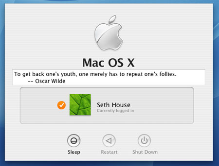

m4TITLE({"Oscar Wilde fortune cookie"})
m4CATEGORY({"computing, unix"})
m4DATE({"2004-09-23"})
m4SUMMARY({"Oscar Wilde is the greatest author of all time. I can prove it. I compiled my 257 favorite quotes as UNIX fortune cookie for your local BSD Games installation."})

Oscar Wilde fortune cookie
==========================

Oscar Wilde is the greatest author of all time. I can prove it.

Besides playwriting, poetry, and the odd novel he is best known for his
many quotations. It is said that if you are unsure of the origin of a
quote you should attribute it to Wilde as he is the most likely to have
coined it.

I looked around for an existing collection of quotes and turned up only
disappointment, so I painstakingly (please mail spelling error
corrections directly to me!) crafted my own list of 257 favorites,
slapped together a Makefile and README, and am now releasing the [Oscar
Wilde UNIX fortune cookie](./wilde.tar.bz2) for your local BSD Games
installation.

