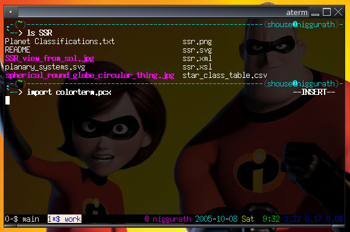

========
Dotfiles
========

.. index:: computing, unix, zsh, screen, vim

:pubdate: 2005-10-08

I've long enjoyed painstakingly constructing `dotfiles`_ or \*rc files for
various programs I use frequently. They allow such exact configuration and
are so portable between systems. `If only Firefox worked so simply`_. (Update
2006-12-20: Firefox does. (Doh!))

Here are some of mine:

-   Zsh is an amazing shell. It has unbelievable completion abilities,
    and is just gorgeous (pictured). I enjoy Vi-mode in my shells and `my
    zshrc has a Vi-style mode display`_ that I cobbled together from a few
    examples on the 'net. It also includes a small shell-function called
    dotsync() that keeps the rest of these dotfiles current.
-   I've spent days of my life fine-tuning the `best goddamn vimrc in the
    whole world`_. Parts of it are very much tailored to me, but I've tried
    to comment all my reasons for each option.
-   GNU screen brings tabs and resume-able sessions to your command-line
    work, this utility is too useful to overlook. `My screenrc file
    illustrates tabs`_ as best as possible (pictured).

There's no reason you should work with an ugly terminal. It's 2005, your
computer can handle it. And nothings beats sitting down at a new computer and
typing ``dotsync`` to have your shell, editor, and browser preferences and
bookmarks instantly configured just they way you like 'em. :-)

.. _dotfiles: http://www.dotfiles.com/
.. _If only Firefox worked so simply: firefox-and-boxen-hopping/index.html
.. _my zshrc has a Vi-style mode display: ../filez/prefs/zshrc
.. _My screenrc file illustrates tabs: ../filez/prefs/screenrc
.. _`best goddamn vimrc in the whole world`: ../filez/prefs/vimrc
