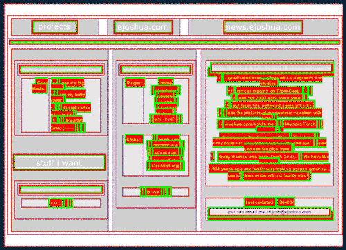

TITLE({"Non-standards compliant website design précis"})
CATEGORY({"computing, web"})
DATE({"2005-01-26"})

Non-standards compliant website design précis
=============================================

Often when trying to evangelize web standards I use a friend's
non-compliant website to offer a comparison in methodologies. Recently I
came across a [bookmarklet](http://meyerweb.com/eric/tools/favelets/)
that outlines deprecated or poor use of various HTML tags and tried it
on his site. [Josh](http://www.ejoshua.com/) is going to hate me for
posting this screenshot, but I thought it was funny.

Everything outlined in red or green is an error.

