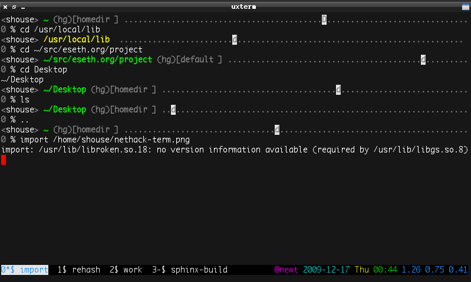

:pubdate: 2009-12-22

.. _post-nethack-term:

==================
Nethack Zsh Prompt
==================
Easy multi-line prompts using Zsh arrays
----------------------------------------

.. index: computing, unix

Overview
========

This is a quick overview of my two- (sometimes three-) line Zsh prompt. It is
built using Zsh arrays which makes the code extremely readable and mantainable.
Each line of the prompt is an element in an array.

:rc:`The code can be found on GitHub. <.zsh_shouse_prompt>`

In addition, I wanted the faithful dog from NetHack to wander around my prompt
as I work. If you have ever played NetHack then you know how useful a good pet
can be. Well, this helpfulness also extends to marathon coding sessions.

Other than that the prompt should strive to be as minimalist as possible while
still providing a wealth of information, as needed:

1.  The prompt changes to red when the last command exited badly.
2.  The current working directory changes to yellow if it isn’t writable.
3.  The number of jobs show up, when there are any.
4.  The hostname only shows up when you’re SSH-ed into another system.

Building the prompt
===================

A step by step walkthrough. Be sure to have the following Zsh manpages handy.

:manpage:`zshexpn(1)`
    Look up expansions in the section titled “PARAMETER EXPANSION”. For
    example, ``${(j: :)somearray}`` to join the elements of an array into a
    string.

:manpage:`zshmisc(1)`
    Look up escapes that you can use in your prompt in the section titled
    “SIMPLE PROMPT ESCAPES”.

:manpage:`zshparam(1)`
    Read about arrays in Zsh in the section titled “ARRAY PARAMETERS”.

:manpage:`zshmodules(1)`
    Read the syntax on how to use ``zstyle``.

Color aliases
-------------

To keep things short lets make some aliases for the colors we intend to use.
(This will also help later when we strip all the color out of the prompt to
determine how wide it is.) As per the `recommendation for prompts`_ on the Zsh
wiki, we’re wrapping all our colors with ``%{..%}``::

    autoload -U colors && colors
    local reset white gray green red

    reset="%{${reset_color}%}"
    white="%{$fg[white]%}"
    gray="%{$fg_bold[black]%}"
    green="%{$fg_bold[green]%}"
    red="%{$fg[red]%}"
    yellow="%{$fg[yellow]%}"

.. _`recommendation for prompts`: http://zshwiki.org/home/config/prompt

The top line
------------

We’re going to store the elements that make up the top line in an array for
now. The top line is the most complicated line of our prompt and that will be
useful when determining how much padding we need for the full-width padding::

    local -a infoline

Add an element to the array containing a color escape based on if the current
directory is writable::

    [[ -w $PWD ]] && infoline+=( ${green} ) || infoline+=( ${yellow} )

Add the escape to show the current directory & path and reset the color::

    infoline+=( "%~ " )
    infoline+=( "${reset} " )

Now add the current username::

    infoline+=( "%n" )

If we’re ssh-ed into a machine, add the hostname::

    [[ -n $SSH_CLIENT ]] && infoline+=( "@%m" )

We want the top line to run the full width of the terminal so we need to take
the width of the terminal window and subtract the width of all the characters
we have assembled so far. Unfortunately this can be a little tricky because
color escapes count as non-zero width.

Since all our colors are already wrapped with ``%{..%}`` the easiest way to
pull out the color is to do a simple search and replace for that wrapper. (The
``(S)`` tells it to search substrings.)::

    local i_width

    i_width=${(S)infoline//\%\{*\%\}}

Great, all the color is gone. We need to expand all the escapes so that ``%~``
gets expanded into ``~/Pictures/lolcats/Superheroes`` (for example) and ``%n``
gets expanded to ``shouse``. While we’re at it, lets also count how many
characters are in the string::

    i_width=${#${(%)i_width}}

:envvar:`$COLUMNS` is automatically set to the width of the terminal window;
finally, we can find the difference of the two variables and see how much
filler we’re going to need::

    local i_filler

    i_filler=$(( $COLUMNS - $i_width ))

Then we can generate that filler; in this case we’re generating ``.``
characters with Zsh’s padding expansion::

    local filler

    filler="${gray}${(l:${i_filler}::.:)}${reset}"

Last we need to insert the filler into our array in the position we want. In
this case we want it right in-between the ``%~`` and the ``%n``::

    infoline[2]=( "${infoline[2]} ${filler} " )

Our top line is complete.

The remaining lines
-------------------

The top line is the hard one since it’s full-width. We’re almost done. We still
need the actual prompt line and we also want a third line to display
version-control status when we’re in a Git/Mercurial/et al repository.

Lets create a new array to hold each line in our prompt and add our top line as
a string::

    local -a lines

    lines+=( ${(j::)infoline} )

Zsh has an awesome contrib module for pulling information from VCS repositories
called ``vcs_info``. You can read about it in :manpage:`zshcontrib(1)`.

.. seealso:: :ref:`post-git-in-zsh`

.. seealso:: :ref:`post-hg-in-zsh`

When it detects that we are inside some VCS repository it fills the variable
``$vcs_info_msg_0_`` so lets add that variable to our array only if it contains
information::

    [[ -n ${vcs_info_msg_0_} ]] && lines+=( "${gray}${vcs_info_msg_0_}${reset}" )

Now lets add the final line that contains the actual prompt::

    lines+=( "%(1j.${gray}%j${reset} .)%(0?.${white}.${red})%#${reset} " )

Last, but not least, lets join all the array elements together in a string
separating them with newlines::

    PROMPT=${(F)lines}

That’s it! Pretty easy, huh?

Conclusion
==========

All together, the code looks like this::

    function setprompt() {
        local -a lines infoline
        local x i pet dungeon filler i_width i_pad

        # A domestic animal, the _tame dog_ (_Canis familiaris_)
        pet=d

        ### First, assemble the top line
        # Current dir; show in yellow if not writable
        [[ -w $PWD ]] && infoline+=( ${green} ) || infoline+=( ${yellow} )
        infoline+=( "%~${reset} " )

        # Username & host
        infoline+=( "%n" )
        [[ -n $SSH_CLIENT ]] && infoline+=( "@%m" )

        # Strip color to find text width & make the full-width filler
        zstyle -T ":pr-nethack:" show-pet && i_pad=4 || i_pad=0

        i_width=${(S)infoline//\%\{*\%\}} # search-and-replace color escapes
        i_width=${#${(%)i_width}} # expand all escapes and count the chars

        filler="${gray}${(l:$(( $COLUMNS - $i_width - $i_pad ))::.:)}${reset}"
        infoline[2]=( "${infoline[2]} ${filler} " )

        ### Now, assemble all prompt lines
        lines+=( ${(j::)infoline} )
        [[ -n ${vcs_info_msg_0_} ]] && lines+=( "${gray}${vcs_info_msg_0_}${reset}" )
        lines+=( "%(1j.${gray}%j${reset} .)%(0?.${white}.${red})%#${reset} " )

        ### Add dungeon floor to each line
        # Allow easy toggling of pet display
        if zstyle -T ":pr-nethack:" show-pet ; then
            dungeon=${(l:$(( ${#lines} * 3 ))::.:)}
            dungeon[$[${RANDOM}%${#dungeon}]+1]=$pet

            for (( i=1; i < $(( ${#lines} + 1 )); i++ )) ; do
                case $i in
                    1) x=1;; 2) x=4;; 3) x=7;; 4) x=10;;
                esac
                lines[$i]="${gray}${dungeon[x,$(( $x + 2 ))]} ${lines[$i]}${reset}"
            done
        fi

        ### Finally, set the prompt
        PROMPT=${(F)lines}
    }

    function precmd {
        vcs_info
        setprompt
    }
