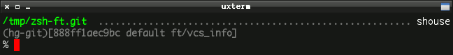
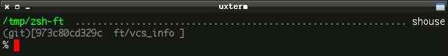
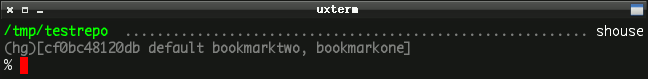
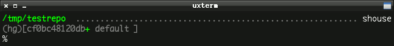
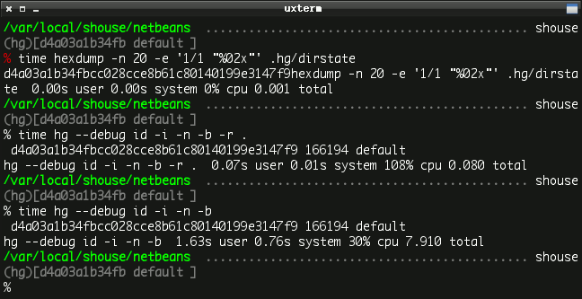
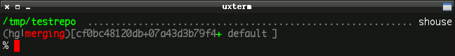
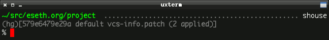
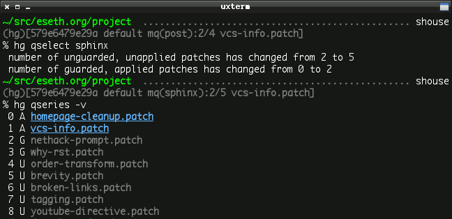
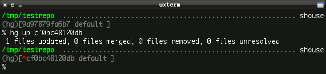
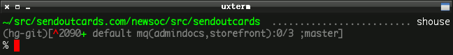

Mercurial Info in Your Zsh Prompt
=================================

See also: [Git in Zsh](./git-in-zsh.html)

What is `VCS_Info`?
-------------------

If you aren't already familiar with `VCS_Info` in Zsh, fire up your
favorite manpage viewer and read through the section in zshcontrib(1).
It allows you to pull information out of a version-controlled repository
and display that in your shell prompt.

The big win for `VCS_Info` over other, similar solutions is that it is
built right into Zsh and supports Bazaar, Codeville, CVS, Darcs, Git,
GNU arch, GNU quilt, Mercurial, Monotone, Perforce, Subversion, and SVK
all using the same configuration. You put it into your prompt once then
as you cd between your favorite git, hg, bzr, or svn local clones it
Just Works®:

Mercurial (using [hg-git](http://hg-git.github.com/)):

Git:

It is also highly customizable.

### `VCS_Info` quickstart

1.  Put the following in your `~/.zshrc`:

        autoload -Uz vcs_info
        zstyle ':vcs_info:*' enable hg git bzr svn

2.  Put \${vcs\_info\_msg\_0\_} somewhere in your \$PS1.
3.  Test it by going into a local repository directory. Your prompt
    should look something like this:

        you@host ~/src/yourcode  (hg)-[default]-
        %

4.  Be amazed and suddenly feel compelled to send [Frank
    Terbeck](http://bewatermyfriend.org) a valentine to say thanks for
    writing `VCS_Info`.

`VCS_Info` Mercurial Support
----------------------------

The first iteration of the Mercurial `VCS_Info` backend would display
the changeset ID, local revision number, current branch, and the topmost
applied [mq](http://mercurial.selenic.com/wiki/MqExtension) patch. Here
are the new features:

::: {.warning}
::: {.admonition-title}
Warning
:::

Many features in `VCS_Info` are disabled by default for performance
reasons. Most of the below styles require customizing your `formats` and
`actionformats` zstyles at least. Look at my customizations below and
give zshcontrib(1) a read before you give up or complain.
:::

### Support for the Bookmarks extension

Enable Mercurial
[bookmarks](http://mercurial.selenic.com/wiki/BookmarksExtension) by
adding the style:

    zstyle ':vcs_info:hg*:*' get-bookmarks true

### Show marker for changes in the working directory

Knowing if there are changes in your working directory at a glance can
be a huge time saver:

    zstyle ':vcs_info:hg*:*' check-for-changes true

### Avoid the overhead of starting the Python interpreter

In very large repositories or on very slow computers, invoking Mercurial
every time the prompt is drawn can simply be too slow. You can
optionally use the hexdump program to fetch the changeset ID instead
which is lightning fast.

For example, the NetBeans repository is 3 GB in size so to enable fast
lookup for just that directory:

    zstyle ':vcs_info:hg*:netbeans' use-simple true

Here are three time tests in the NetBeans repo to give you an idea of
the speed difference. Note that by specifying the current revision with
`-r .` causes Mercurial to ignore the state of the working directory
which goes a little faster but doesn't look for changes.

::: {.note}
::: {.admonition-title}
Note
:::

You cannot retrieve the local revision number with hexdump.
:::

### Display the current action

Show when rebasing or merging. Define `actionformats`:

    zstyle ':vcs_info:hg*' actionformats "(%s|%a)[%i%u %b %m]"

### Display both parents during a merge

Mercurial separates multiple parents with a `+` by default:

This doesn't (currently) work with the `use-simple` setting, although I
think the second parent hash is available with hexdump so this may be
added in the future.

### Detection for [hg-git](http://hg-git.github.com/), [hgsubversion](http://www.bitbucket.org/durin42/hgsubversion/), and [hgsvn](http://pypi.python.org/pypi/hgsvn/)

It can be useful to see when you are in a repo created from another VCS
since your workflow is often altered.

### Improved [mq](http://mercurial.selenic.com/wiki/MqExtension) display

Show the names and count of both applied and unapplied patches.
`VCS_Info` supports this same configuration for
[stgit](http://www.procode.org/stgit/) and
[Quilt](http://savannah.nongnu.org/projects/quilt) as well.

### Support for [mq](http://mercurial.selenic.com/wiki/MqExtension) guards

The unapplied count now takes
[guards](http://hgbook.red-bean.com/read/advanced-uses-of-mercurial-queues.html)
into account.

`VCS_Info` Hooks
----------------

Hooks are a great and open-ended way to customize the output. The hooks
documentation is really good and worth a read.

For example, I wanted to add a marker to the display when I'm not
currently on a branch head:

The hook looks like this:

    zstyle ':vcs_info:hg*+set-message:*' hooks hg-storerev hg-branchhead

    ### Store the localrev and global hash for use in other hooks
    function +vi-hg-storerev() {
        user_data[localrev]=${hook_com[localrev]}
        user_data[hash]=${hook_com[hash]}
    }

    ### Show marker when the working directory is not on a branch head
    # This may indicate that running `hg up` will do something
    function +vi-hg-branchhead() {
        local branchheadsfile i_tiphash i_branchname
        local -a branchheads

        local branchheadsfile=${hook_com[base]}/.hg/branchheads.cache

        # Bail out if any mq patches are applied
        [[ -s ${hook_com[base]}/.hg/patches/status ]] && return 0

        if [[ -r ${branchheadsfile} ]] ; then
            while read -r i_tiphash i_branchname ; do
                branchheads+=( $i_tiphash )
            done < ${branchheadsfile}

            if [[ ! ${branchheads[(i)${user_data[hash]}]} -le ${#branchheads} ]] ; then
                hook_com[revision]="${c4}^${c2}${hook_com[revision]}"
            fi
        fi
    }

::: {.note}
::: {.admonition-title}
Note
:::

The reason this functionality isn't in the core backend is because the
branchheads.cache isn't updated with every hg operation so on occasion
it will give a false positive. Most of the time it is Good Enough®.
:::

Putting it All Together
-----------------------

You can pack quite a lot of information into your prompt (if you want
to):

If you are interested, the entirely of my `VCS_Info` configuration is
available on GitHub or BitBucket in my [Zsh prompt
file](https://github.com/whiteinge/dotfiles/blob/master/.zsh_shouse_prompt).

Here are the important lines (omitting hooks and colors). `hg*` ensures
the same style is applied to `hg` as well as variants like `hg-git`,
`hg-hgsubversion`, etc.:

    zstyle ':vcs_info:*' enable hg git bzr svn
    zstyle ':vcs_info:(hg*|git*):*' get-revision true
    zstyle ':vcs_info:(hg*|git*):*' check-for-changes true

    # rev+changes branch misc
    zstyle ':vcs_info:hg*' formats "(%s)[%i%u %b %m]"
    zstyle ':vcs_info:hg*' actionformats "(%s|%a)[%i%u %b %m]"

    # hash changes branch misc
    zstyle ':vcs_info:git*' formats "(%s)[%12.12i %u %b %m]"
    zstyle ':vcs_info:git*' actionformats "(%s|%a)[%12.12i %u %b %m]"

    zstyle ':vcs_info:hg*:netbeans' use-simple true

    zstyle ':vcs_info:hg*:*' get-bookmarks true

    zstyle ':vcs_info:hg*:*' get-mq true
    zstyle ':vcs_info:hg*:*' get-unapplied true
    zstyle ':vcs_info:hg*:*' patch-format "mq(%g):%n/%c %p"
    zstyle ':vcs_info:hg*:*' nopatch-format "mq(%g):%n/%c %p"

    zstyle ':vcs_info:hg*:*' unstagedstr "+"
    zstyle ':vcs_info:hg*:*' hgrevformat "%r" # only show local rev.
    zstyle ':vcs_info:hg*:*' branchformat "%b" # only show branch

Try the New Features Now! {#dont-wait}
-------------------------

These new features are still unreleased (as of Zsh 4.3.10). You don't
have to wait for the next release of Zsh to try them. Full instructions
to keep a local checkout from CVS are located in the [vcs\_info-examples
file](http://zsh.git.sourceforge.net/git/gitweb.cgi?p=zsh/zsh;a=blob;f=Misc/vcs_info-examples).

*tl;dr*:

1.  Download the [latest
    snapshot](http://zsh.git.sourceforge.net/git/gitweb.cgi?p=zsh/zsh;a=snapshot;sf=tgz)
    tarball from the Git mirror and untar it.
2.  Put the `Functions/VCS_Info` directory from the archive somewhere.
    `~/.zfuncs` is a good place.
3.  Point your Zsh at that directory (requires extended\_glob to be
    set):

        fpath=( ~/.zfuncs ~/.zfuncs/VCS_Info/**/*~*/(CVS)#(/) $fpath )

4.  Restart Zsh:

        % exec zsh
