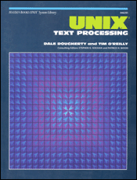
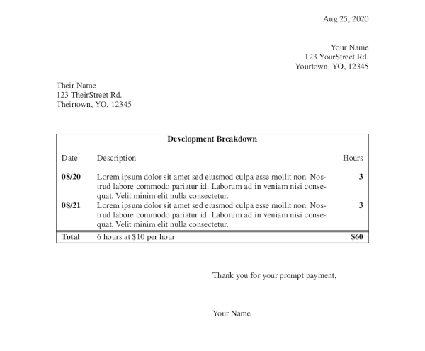

m4TITLE({"Generate PDF Invoices from the CLI with groff"})
m4CATEGORY({"computing, unix"})
m4DATE({"2020-08-25"})
m4SUMMARY({"Generate a PDF invoice from a plain text timelog using groff, m4, and a splash of awk"})

# Generate PDF Invoices from the CLI with groff

I've been curious about roff (troff, nroff, groff, etc) for years. I knew it
was used to format manpages and that it could produce PDFs in some capacity,
and that it had a crazy [ecosystem of
preprocessors](https://troff.org/prog.html) (tbl, pic, eqn, soelim, chem,
dformat , grap, dot, refer, bib, ideal, grn, g3) but not much else.

I stumbled across an old book from 1987 by Dale Dougherty and Tim O'Reilly
called _Unix Text Processing_. They've made it [freely
available](https://www.oreilly.com/openbook/utp/) and there's even an amazing
community project to [recreate and modernize the
book](http://home.windstream.net/kollar/utp/).



The book is a great read and covers a variety of topics including several
chapters on roff.

I was surprised to learn roff is a very sophisticated typesetting language, not
unlike the famous [LaTeX](https://en.wikipedia.org/wiki/LaTeX). It can produce
great looking PDF files -- and with all the hyphenation and typographic
algorithmic bells and whistles you've come to expect from LaTeX. It can also
produce ASCII and manpages from the same source files. I love LaTeX and used it
for years to write school papers and presentations (with Beamer) but I'm
extremely impressed with roff now that I know something about it. The author
of the _mom_ macro set wrote a great comparison: [Reflections on GNU troff
(groff)](https://www.schaffter.ca/mom/mom-03.html)

One of the most noteworthy differences for me is that a typical LaTeX
installation takes up gigabytes of space -- often between 1.5 GB and 4 GB. It's
a huge and very complicated ecosystem. While roff certainly has plenty of the
same historical eccentricities and puzzling syntax for modern readers, it's
comparatively much more simple yet still plenty powerful. A typical
installation weighs in at 15 MB and if you're running OS X, Linux, or WSL it is
**already preinstalled on your computer**.

## Generate a PDF invoice

Below is a complete example of how to write an invoice using groff, the tbl
preprocessor, and the mom macro set (included with groff).

```roff
.AUTHOR "Your Name"
.DOCTYPE LETTER
.PRINTSTYLE TYPESET
.START
.DATE
Aug 25, 2020
.FROM
.RIGHT
Your Name
123 YourStreet Rd.
Yourtown, YO, 12345
.TO
Their Name
123 TheirStreet Rd.
Theirtown, YO, 12345
.PP
.TS H
tab(|),expand,box;
cb s s
l l l
lb lw55 rb .
Development Breakdown
.SP
Date|Description|Hours
.TH
.SP
08/20|T{
Lorem ipsum dolor sit amet sed eiusmod culpa esse mollit non. Nostrud labore
commodo pariatur id. Laborum ad in veniam nisi consequat. Velit minim elit
nulla consectetur.
T}|3
08/21|T{
Consequat irure magna ut dolor sint cupidatat nulla esse. Et occaecat fugiat ad
eiusmod pariatur anim proident est. Laboris culpa aliqua ut non. Sed duis nisi
dolore in. Voluptate commodo id labore minim aliquip ullamco.
T}|3
=
Total|6 hours at $10 per hour|$60
.TE
.PP
.HI
.CLOSING
Thank you for your prompt payment,
```

Generate the PDF with the command:

```sh
groff -t -mom -Tps invoice.roff | ps2pdf - invoice.pdf
```

And the result looks something like this:



Not bad for less than less than 50 lines of markup and with tools that came
preinstalled on your computer. :-)

That's it. Oh, and if you'd prefer to keep your time in a plain text format
look at this [invoice
script](https://github.com/whiteinge/dotfiles/blob/1afeb7462a8fb4ce310f2781fa4b333447691cf8/bin/invoice)
and feel free to use it as-is or adapt it to your needs.
