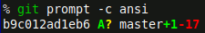

m4TITLE({"One call Git status for your shell prompt"})
m4CATEGORY({"computing, unix"})
m4DATE({"2020-01-25"})
m4SUMMARY({"All the info you need for a Git shell prompt in one Git invocation"})

# One call Git status for your shell prompt

There are a _million_ projects that retrieve status info from Git and reformat
it for use in a shell prompt
([1](https://github.com/magicmonty/bash-git-prompt),
[2](https://starship.rs/),
[3](https://github.com/dahlbyk/posh-git)).
Git itself even [ships with
one](https://github.com/git/git/blob/101b3204f37606972b40fc17dec84560c22f69f6/contrib/completion/git-prompt.sh).
Zsh has an excellent built-in system called `vcs_info` that I've contributed to
and [written about before](../2010/git-in-zsh.html).

The way these scripts usually work is to invoke Git many times in order to
retrieve all the information you might want in your shell prompt -- branch,
current SHA, staged/unstaged files, whether your working directory is dirty,
and the number of commits ahead or behind the remote-tracking branch. They
often invoke Git half-a-dozen times or more but it doesn't matter because Git
is so fast you won't notice the delay while the shell is drawing your prompt.
In contrast Mercurial, using Python, [hasn't always enjoyed that same fast
start-up](../2010/hg-in-zsh.html) and needed performance tricks to avoid
slowing your shell prompt.

There was an addition to Git in 2016 that adds
[--porcelain=v2](https://github.com/git/git/commit/00d27937bf0348e7da615f04b65f535a58e096c1)
to the `git status` command to fetch more of this information on a single
invocation. Git is already fast but better efficiency is better :). Plus the
output format is a delight to work with.

```sh
git \
    --no-optional-locks \
    status \
    --porcelain=v2 \
    --branch
```

The `--no-optional-locks` flag is useful for a shell prompt since it'll be
running Git often, sometimes while something else is also running Git, and you
can occassionally see lock errors.

With a little `awk` you can quickly ingest all that output to reformat it into
a prompt:

```awk
/^# branch\.oid/ { sha=substr($3, 0, 12) }
/^# branch\.head/ { branch=$3 }
/^# branch\.upstream/ { upstream=$3 }
/^# branch\.ab/ {
    a = $3 != "+0" ? $3 : ""
    b = $4 != "-0" ? $4 : ""
}
/^\?/ { untracked="?" }
/^[0-9] [A-Z]. / { added="A" }
/^[0-9] .[A-Z] / { modified="M" }
/^u UU/ { conflicts="UU" }

END {
    print (\
        sha,
        conflicts \
        added \
        modified \
        untracked ,
        branch \
        a \
        b)
}
```

I wrote one as a custom [git prompt
script](https://github.com/whiteinge/dotfiles/blob/59e61819c6278fcf21b7577d994f597d4be3b9bb/bin/git-prompt)
to use tmux or ansi color escapes:



A single invocation and a simple, straightforward parse is much nicer than what
we've had to do in the past.
