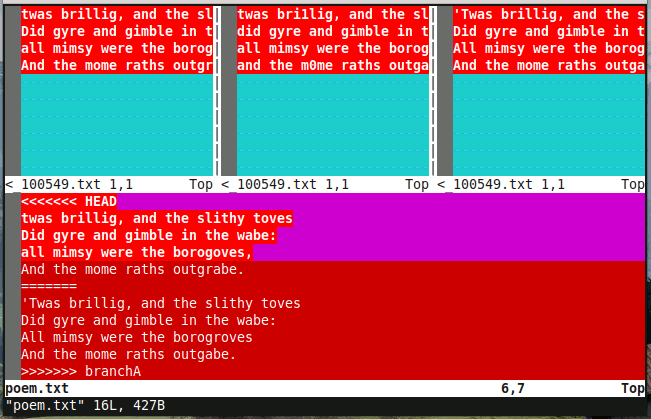
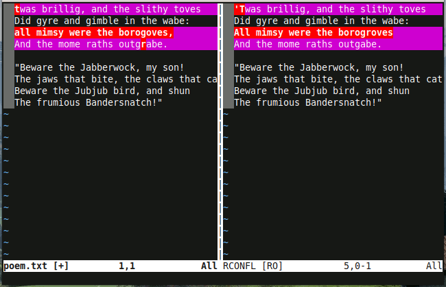
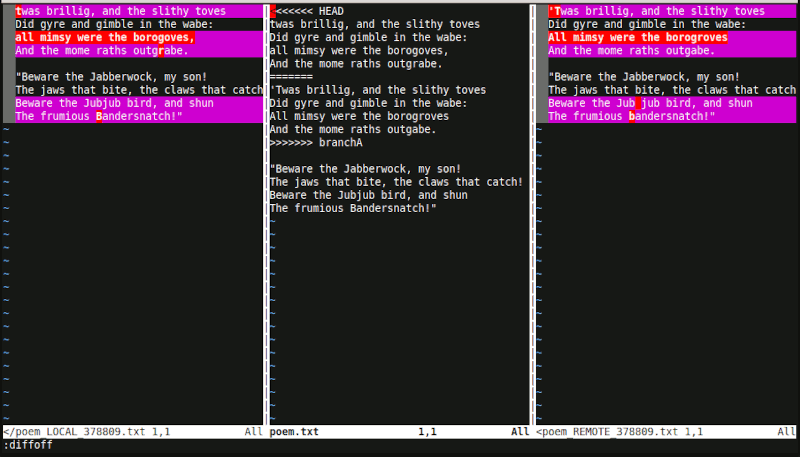

m4TITLE({"Mergetools: Stop doing three-way merges!"})
m4CATEGORY({"computing"})
m4DATE({"2020-12-08"})
m4SUMMARY({"A three-way merge will not help you resolve merge conflicts."})

# Mergetools: Stop doing three-way merges!

_A three-way merge will not help you resolve merge conflicts._

Git mergetools can be an amazing, concise, and _precise_ way of resolving
tricky merge conflicts. But for the most part they're all very hard to use,
especially for beginners, and it's because they all make the exact same mistake.

## Prefer video?

The problem and solution from this post is demonstrated in the video below.
Ignore the Vim-specific parts as the problem and solution is relevant for all
mergetools.

<iframe width="560" height="315"
src="https://www.youtube.com/embed/Pxgl3Wtf78Y" frameborder="0"
allow="accelerometer; autoplay; clipboard-write; encrypted-media; gyroscope;
picture-in-picture" allowfullscreen></iframe>

## Why use a mergetool?

Mergetools exist because nobody wants to edit conflict markers by hand. It's
very difficult to do reliably, especially for subtle changes. Try to resolve
the following conflict without accidentally losing a wanted change from either
side. (Hint: there are five wanted changes.)

```
<<<<<<< HEAD
twas brillig, and the slithy toves
Did gyre and gimble in the wabe:
all mimsy were the borogoves,
And the mome raths outgrabe.
=======
'Twas brillig, and the slithy toves
Did gyre and gimble in the wabe:
All mimsy were the borogroves
And the mome raths outgabe.
>>>>>>> branchA

"Beware the Jabberwock, my son!
The jaws that bite, the claws that catch!
Beware the Jubjub bird, and shun
The frumious Bandersnatch!"
```

Manually removing conflict markers and manually moving individual changes from
one section to another is just generally boring, error-prone work.

## Background

When you start a merge in Git and there is a conflict there are several
versions of the file that are in play:

- `LOCAL` - the version of the file on your current branch.
- `REMOTE` - the version of the file from the branch that you're merging into
  your current branch.
- `BASE` - the version of the file that your branch and the remote branch
  started from.
- `MERGED` - the version of the file that contains every change from `LOCAL`
  and `REMOTE` -- including conflicts that Git _was_ able to automatically
  resolve, and conflicts that Git _wasn't_ able to automatically resolve.
  (Hint: this is important!)

Almost every mergetool works the same way: they open `LOCAL`, `REMOTE`, and
`MERGED` and then perform a three-way diff between them.

## Problem

The common mistake is that most every mergetool diffs `LOCAL` against `REMOTE`.
Look again at the description of `MERGED`: Git automatically resolves a bunch
of stuff and that hard work is _only_ represented in `MERGED`.

A mergetool that diffs `LOCAL` and `REMOTE` will display a bunch of changes
that Git may have already resolved for you, and the tool is asking you to
resolve them yet again but manually. A mergetool is supposed to help you
resolve conflicts and avoid dealing with conflict markers but **almost every
mergetool makes it harder and makes it more work to resolve conflicts**. It's
no wonder that mergetools aren't more widely used.

Compare the example above with conflict markers to the default vimdiff view:



It's a mess. Yes, vimdiff is particularly egregious but other mergetools have
the exact same problem just with fewer awful colors.

## Solution

The goal of this post is to encourage all mergetools to adopt some variant of
the simple approach of "unmerging" `MERGED` and diffing both halves.

**A file containing conflict markers is a two-way diff.**

It can be demonstrated with two lines of `sed`:

```sh
sed -E -e '/^=======\r?$/,/^>>>>>>> /d' -e '/^<<<<<<< /d' "$MERGED" > "$LEFT_CONFLICTS"
sed -E -e '/^<<<<<<< /,/^=======\r?$/d' -e '/^>>>>>>> /d' "$MERGED" > "$RIGHT_CONFLICTS"
```

Or in English: Make two copies of `MERGED`. One with all the right-hand
conflicts removed; one with all the left-hand conflicts removed.

Diff those two files. Allow users to combine individual changes from both left
and right. Replace `MERGED` with the result.

That's it.

This is what the above conflict looks like as a two-way merge. The resolution
suddenly becomes much, much more clear and obvious.



`LOCAL` and `REMOTE` and `BASE` are very useful to understand the history
leading up to the conflict. You can (and should!) read the relevant parts from
those files. You should use [Git's merge
log](https://www.git-scm.com/book/en/v2/Git-Tools-Advanced-Merging#_merge_log)
for even more understanding. You should even individually compare the relevant
sections of thsoe files with the left or right half of `MERGED` -- and maybe
that does mean _temporarily_ showing a diff between them.

After you understand the history of the conflict and when it comes time to
resolve those conflicts, you should only resolve them as a diff between the
left half of `MERGED` and the right half of `MERGED`.

## Summary

Mergetool authors:

Please continue to display `LOCAL` and `REMOTE`! Please display `BASE`. Please
highlight the relevant sections of those files. But **don't** include those
files in the diff. It doesn't help.

**Do** show the "left" and "right" sides of the conflict markers as a two-way
diff. Allow the user to grab individual changes from either side.

I want this technique adopted by every tool. Software is hard. The world will
be a better place if it's easier to avoid accidentally losing changes during
a merge conflict.

---

## A comparison of default mergetools

I've tested all the default mergetools that ship with Git that were easily
installable on Fedora or Brew, plus Sublime Merge and VS Code. I'll try to add
others to the list over time.

I'm using [a script in the `diffconflicts` repository that generates subtle
merge
conflicts](https://github.com/whiteinge/diffconflicts/tree/master/_utils#readme).
Here are some results to watch out for in a good mergetool:

1.  The `bri1lig` -> `brillig` conflict was automatically resolved. It should
    not be shown to the user.
2.  The `m0me` -> `mome` conflict was automatically resolved. It should not be
    shown to the user.
3.  The `did` -> `Did` conflict was automatically resolved. It should not be
    shown to the user.
4.  All conflicts in the second stanza were automatically resolved. They should
    not be shown to the user.
5.  The conflict on the first line _is_ an "ours vs. theirs" situation. We only
    want theirs.
6.  The conflict on the third line _is not_ an "ours vs. theirs" situation. We
    want changes from both:
    - Want the capitalization change from theirs.
    - Want the extra 'r' removal from ours.
    - Want the hanging punctuation change from ours.
7.  The conflict on the fourth line should be easily noticeable. We want the
    'r'.

All of them tested so far get it wrong by diffing `LOCAL` against `REMOTE` and
sometimes also against `BASE`. _All of them._

### Araxis

Wrong. Diffs `LOCAL` against `REMOTE` against `BASE`. A mess of changes, most
of which Git already resolved, and those resolutions in `MERGED` are not even
present at all.


### Beyond Compare

Wrong. Diffs `LOCAL` against `REMOTE` against `BASE`. A mess of changes, most
of which Git already resolved. The bottom pane is an odd jumble of multiple
versions from all three files and completely ignores the resolutions Git
already performed. In addition the bottom pane is diffed against the above
three which makes the highlighted changes meaningless.


Beyond compare has a "show conflicts" mode which removes some noise, but it
still only show conflicts between `LOCAL` and `REMOTE`, ignoring `MERGED` and
repeating automatically resolved conflicts.

### DiffMerge

Wrong. Diffs `LOCAL` against `REMOTE` against `BASE`. A mess of changes, most
of which Git already resolved, and those resolutions in `MERGED` are not even
present at all.


DiffMerge automatically resolves conflicts itself by also looking at `BASE` and
while it did resolve some conflicts Git did a much, much better job.

### kdiff3

Wrong. Diffs `LOCAL` against `REMOTE` against `BASE`. A mess of changes, most
of which Git already resolved, and those resolutions in `MERGED` are not even
present at all. The bottom pane unhelpfully shows the conflicts as `<Merge
Conflicts>` and doesn't try to show them at all.


### Meld

Wrong. Diffs `LOCAL` against `REMOTE` against `BASE`. A mess of changes, most
of which Git already resolved, and those resolutions in `MERGED` are not even
present at all. The lack of character-level differences just shows solid blocks
of changes that don't help with resolution at all or even a little bit.


### Sublime Merge

Wrong. (But gorgeous!) Diffs `LOCAL` against `REMOTE` against `BASE` or
`MERGED`. It hides the conflicts behind an unhelpful `CONFLICT` marker.


Sublime Merge gets it wrong like most the others however the way it represents
differences is much less visually distracting. It's tantalizing close to being
useful in grasping the history of the conflict at-a-glance.

Unfortunately it doesn't try to display complex conflicts at all, and you can
only choose "hunks" of a conflict which makes grabbing part of one change and
part of another very difficult.

I would _love_ to see a two-way diff between each side of `MERGED` in the
middle, bookended by `LOCAL` and `REMOTE` with those whisp lines to direct your
eyes to the relevant sections. **It could be greatness.**

### tkdiff

Wrong. (But closer!) A two-way diff between `LOCAL` and `REMOTE` but it appears
to have also used `BASE` and resolved _some_ of the conflicts by itself. The
two-way diff and character-level difference highlights make the resolution
steps very, very clear and straightforward.


An effort worthy of praise and if we were diffing files without Git it would be
a useful tool indeed. Unfortunately Git resolved those conflicts better and we
don't see that work reflected anywhere here.

So close!

### vimdiff

Wrong. So, so wrong. A four-way diff between `LOCAL`, `BASE`, `REMOTE`, and
`MERGED` make this a solid block of unhelpful red. The resolution must be
performed in the bottom pane by manually editing the conflict markers. The diff
tells you nothing and the resolution is every bit as hard as doing it without
a mergetool.


The newer vimdiff2 also get it's wrong. Although the differences highlighting
is much, much more clear it still diffs `LOCAL` against `REMOTE` which forces
you to re-resolve conflicts that Git has already resolved.



(Depending on your Git version it will open two or three windows instead of the
default four, but in all cases it diffs `LOCAL` against `REMOTE`. vimdiff2
pictured above with `:diffoff` on the middle pane to showcase both the
two-window and three-window variants.)

### VS Code

So very, very close! A two-way diff between each side of `MERGED`! Exactly what
you'd want to resolve the conflicts.


Unfortunately you must first view the file with the conflict markers, then
avoid the temptation to of clicking the easy-buttons that just choose all the
changes in one side or the other, and then click the "compare changes" button.

But then _tragically_ it opens the above screenshot as a new, read-only view so
you can't actually resolve conflicts in the two-way diff but must instead go
back to the file with conflict markers, remember what change you wanted to
make, and then make the fix manually.

It could be great if only the two-way diff was the default view and the buffer
was editable.

---

## Addendum

This is a good place to stop reading. If you are interested to read more about
such an esoteric topic then you are my kind of weird and we should be friends.

Ten years ago I was [inspired by
xxdiff](https://github.com/whiteinge/dotfiles/commit/358ca434fc474d59b9f0f6d84bf92b85b1faef81)
to use an "unmerge" script to split a file containing conflict markers into two
halves and diff those. I thought it was an obvious approach and other tools
would also adopt it. They didn't.

The script eventually expanded to Vim Tips as [A better Vimdiff Git
mergetool](https://vim.fandom.com/wiki/A_better_Vimdiff_Git_mergetool), and
(much) later became a standalone Vim plugin called
[diffconflicts](https://github.com/whiteinge/diffconflicts).

I'm a Vim user and so my scripts use vimdiff but **this technique should be
even more effective in a rich, graphical tool** that can more beautifully
display a two-way diff in addition to useful surrounding context such as Git
log integration and highlighting (not diffing!) `LOCAL` and `REMOTE`. There's
no comparison between the aesthetics of vimdiff and Sublime Merge. ;-)

There is [a script in the `diffconflicts` repository that generates subtle
merge
conflicts](https://github.com/whiteinge/diffconflicts/tree/master/_utils#readme).
It is useful to test Git behavior and compare mergetools.

## How does Git generate `MERGED`?

It is worth asking how much work Git puts into creating the `MERGED` version of
the file to appreciate how much work you lose by instead diffing `LOCAL` and
`REMOTE`.

(The following snippets are from the Git manpages for version 2.28.0.)

First, find the common ancestor, the merge base, of both branches:

> Given two commits A and B, git merge-base A B will output a commit which is
> reachable from both A and B through the parent relationship.
> 
> For example, with this topology:
>
>             o---o---o---B
>            /
>     ---o---1---o---o---o---A
>
> the merge base between A and B is 1.
>
> — `git-merge-base`

Second, trace the history of all the changes to the file between the merge base
and the last commit on the branch (including renames):

> git merge-file incorporates all changes that lead from the <base-file> to
> <other-file> into <current-file>.
>
> — `git-merge-file`

Then, try to perform the merge:

> Assume the following history exists and the current branch is "master":
>
>           A---B---C topic
>          /
>     D---E---F---G master
>
> Then "git merge topic" will replay the changes made on the topic branch since
> it diverged from master (i.e., E) until its current commit (C) on top of
> master, and record the result in a new commit along with the names of the two
> parent commits and a log message from the user describing the changes.
>
>           A---B---C topic
>          /	      \
>     D---E---F---G---H master
>
> — `git-merge`

But when there is a conflict:

> During a merge, the working tree files are updated to reflect the result of the
> merge. Among the changes made to the common ancestor’s version, non-overlapping
> ones (that is, you changed an area of the file while the other side left that
> area intact, or vice versa) are incorporated in the final result verbatim. When
> both sides made changes to the same area, however, Git cannot randomly pick one
> side over the other, and asks you to resolve it by leaving what both sides did
> to that area.
>
> — `git-merge`

Pretty cool. By default (with the recursive merge strategy) it will follow file
renames and grab changes from both sides of the merge that don't change the
same part of the file. For everything else it will wrap it in conflict markers.

A sophisticated mergetool could perform similar steps given `LOCAL`, `REMOTE`,
and `BASE` but it couldn't follow renames, nor could it follow more complex
merges like when the merge base is itself a merge (thus the "recursive"
strategy name) and it's necessary to follow the ancestry even farther up.

Git also has other merge strategies (resolve, recursive, octopus, ours,
subtree) and merge algorithms (patience, minimal, histogram, myers) that can be
employed when useful. Some of those algorithms take arguments too
(ignore-space-change, ignore-all-space, ignore-space-at-eol, ignore-cr-at-eol,
renormalize, rename-threshold).

So, yes, a mergetool can do some of what Git does. But Git is already
a sophisticated and very configurable mergetool. It's just lacking that
graphical visualization of the end-result.
