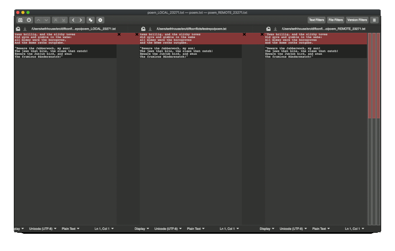
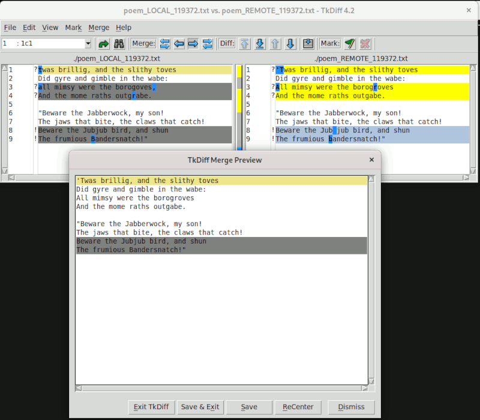

m4TITLE({"Mergetools: Stop doing three-way merges!"})
m4CATEGORY({"computing"})
m4DATE({"2020-12-08"})
m4SUMMARY({"A three-way merge will not help you resolve merge conflicts."})

# Mergetools: Stop doing three-way merges!

*Update 2021-03-08:* This post took a different direction than I intended.
Thanks to several people on the Git mailing list [there is a patch to make this
change in upstream
Git](https://lore.kernel.org/git/20210209200712.156540-1-seth@eseth.com/)
rather than in individual mergetools. As such, I've updated this post to
reflect what ramifications that upstream change will have on the mergetools
surveyed below. [The original post is still
available](https://github.com/whiteinge/eseth/blob/e993b4b9c5f7e5d2c83890bcb7cd218abe867afd/2020/mergetools.md).
It appears to be slated for inclusion in the v2.31.0 Git release.

**Table of Contents**:

{{TOC:2-3}}

## Conflict Resolution [conflict-resolution]

When there is a merge conflict in Git there are several versions of the
conflicted file that all represent different times in the lifecycle of that
file:

The `LOCAL` version of the file is what the file looks like on your branch
_before the merge started_.

The `REMOTE` version of the file is what the file looks like on the other
branch _before the merge started_.

The `BASE` version of the file is what the file looks like from before the
point that your branch and the other branch diverged. It's the most recent
common ancestor of both branches.

When there is a conflict a tool that performs conflict resolution will compare
those three files against one another in order to try and resolve any
conflicting changes without human intervention. Any conflicts that cannot be
automatically resolved must be resolved manually by a person.

Git is one such tool that performs conflict resolution but there are also many
others. In general, a conflict resolution algorithm will produce the best
results by starting with all three versions of the conflicted file instead of
just looking at the latest two versions. An excellent algorithm, such as the
one Git uses, [will do even more work](#gits-merged).

If there is a conflict that must be resolved manually then Git will write
a fourth file named `MERGED` which contains everything Git was able to resolve
by itself and also everything that it was not able to resolve. This is the file
containing conflict markers that you may already be familiar with.

The most notable thing about `MERGED` is that **a file containing conflict
markers represents a two-way diff.** Writing conflict markers is a nice,
simple, and static way to represent conflicts. Conflicts may be visualized
directly by just looking at the file (though it's very difficult to spot subtle
differences), or those same conflicts may be visualized another way using
specialized tools often called "mergetools" in the Git ecosystem.

## Mergetool Categories [mergetool-categories]

There are three "categories" of mergetools that I've seen in my limited
travels. There are many others that I haven't seen yet, and there's every
likelihood that I have miscategorised some of them, so please take this broad
categorization with a grain of salt and [corrections are very
welcome](https://github.com/whiteinge/eseth/issues/new).

### Blind Diff [blind-diff]

Most mergetools surveyed below _do not_ perform their own conflict resolution,
_nor_ do they make use of Git's conflict resolution, but rather they simply
present the user with a diff of two or more files.

Often this is a diff of `LOCAL` and `REMOTE`. As explained above, this approach
will often present the end-user with unnecessary differences that have already
been resolved by Git. This forces the user to re-resolve those differences by
hand.

It is also common to diff `LOCAL` and `REMOTE` and `BASE`. This approach will
usually produce quite a lot of unhelpful visual noise and forces the end-user
to perform all the same mental steps that a merge algorithm would perform --
and, again, steps Git's merge algorithm already performed.

Finally, another common configuration is to diff `LOCAL` and `REMOTE` and
`BASE` _and_ `MERGED`. This approach produces an _impenetrable_ amount of
visual noise and is effectively useless.

Some mergetools do allow the user to selectively turn off the diff comparison
in order to only compare two panes at a time. This helps to reduce visual noise
but still requires the end-user manually resolve all conflicts.

### Custom Merge Algorithm [custom-algorithm]

More sophisticated mergetools have their own conflict resolution algorithms.
Sometimes these algorithms are quite clever. Although [Git's algorithm is
excellent and has many options](#gits-merged) it is by no means the final
word and innovation in conflict resolution algorithms is alive and well. We
_want_ other tools to compete with Git in this arena because it will have
positive outcomes for everyone.

[As described above](#conflict-resolution) a conflict resolution algorithm will
almost certainly want to start with `LOCAL`, `REMOTE`, and `BASE`, and any
additional information about the merge or file history can help.

A mergetool with a custom conflict resolution algorithm _may_ want to look at
the result of Git's algorithm that is stored in `MERGED` or it may want to do
its own thing entirely. Both approaches are fine -- Git does a great job but
maybe somebody else can do better.

### Reuse Git's Algorithm [gits-algorithm]

The last category of mergetools entirely rely on the conflict resolution that
Git automatically performs and stores in `MERGED`. They usually work by
splitting `MERGED` into two halves and showing the end-user each half as
a two-way diff.

This is a very simple approach that presents the smallest amount of visual
noise to the end-user and relies on Git to do _all_ of the hard work. (Which,
it should be noted, Git is already doing anyway.)

These tools may, optionally, show the end-user additional information that
could be useful in understanding the file history leading up to the conflict.
This often includes temporarily showing `LOCAL`, `REMOTE`, or `BASE` or
invoking additional Git commands to show the file history. However the actual
conflict resolution is done by resolving the two halves of `MERGED` that
contain the minimal, remaining conflicts.

## `hideResolved` Proposal [hideResolved]

[There is a patch in upstream
Git](https://lore.kernel.org/git/20210209200712.156540-1-seth@eseth.com/) to
add a flag that will make the [Blind Diff mergetools](#blind-diff) work more
like the [tools that Reuse Git's Algorithm](#gits-algorithm) by splitting
`MERGED` and _overwriting_ `LOCAL` and `REMOTE` with each half.

This flag will allow these tools to benefit without making any other changes.
At the time of this writing the proposal is to enable the flag by default.

Mergetools that want to display the original versions of `LOCAL` and `REMOTE`,
or tools that want to use those original versions in their own conflict
resolution algorithm may toggle this flag off. Mergetools that want the
original verions of those files _and_ the result of Git's resolution can simply
disable the flag and split `MERGED` themselves.

Given the large prevalence of tools in that first category, defaulting to an
opt-out setting will positively affect many more users than an opt-in setting
would. Plus the authors of more sophisticated mergetools that prefer it to be
disabled are better able to recognize the pros and cons and make an informed
choice.

---

## Mergetool Comparison [mergetool-comparison]

Below is a comparison of several default mergetools that ship with Git plus
some other popular tools. I'll try to add others to the list over time. [Fixes
and contributions are welcome.](https://github.com/whiteinge/eseth/issues/new)

In addition, the tools surveyed below also have a before/after summary to
visualize the ramifications of the new `hideResolved` flag proposal.

This uses [a script in the `diffconflicts` repository that generates subtle
merge
conflicts](https://github.com/whiteinge/diffconflicts/tree/master/_utils#readme).
Here are some results to watch out for the comparisons:

1.  The `bri1lig` -> `brillig` conflict was automatically resolved. It should
    not be shown to the user.
2.  The `m0me` -> `mome` conflict was automatically resolved. It should not be
    shown to the user.
3.  The `did` -> `Did` conflict was automatically resolved. It should not be
    shown to the user.
4.  All conflicts in the second stanza were automatically resolved. They should
    not be shown to the user.
5.  The conflict on the first line _is_ an "ours vs. theirs" situation. We only
    want theirs.
6.  The conflict on the third line _is not_ an "ours vs. theirs" situation. We
    want changes from both:
    - Want the capitalization change from theirs.
    - Want the extra 'r' removal from ours.
    - Want the hanging punctuation change from ours.
7.  The conflict on the fourth line should be easily noticeable. We want the
    'r'.

### Araxis Merge

Category: [Blind Diff](#blind-diff) — diffs `LOCAL`, `REMOTE`, & `BASE`.

Before `hideResolved`:

After `hideResolved`:

**Summary: uneccessary conflicts are no longer shown; no adverse effects.**

Suggestions for tool authors:

* Don't include `BASE` in the default diff. Continue to show the file, and have
  a toggle to compare `BASE` with the left or right pane, but the resolution
  will almost always only come from the `LOCAL` or `REMOTE` panes so make it
  easier to grab individual changes from both.

### Beyond Compare

Category: [Blind Diff](#blind-diff) — diffs `LOCAL`, `REMOTE`, & `BASE`.

Before `hideResolved`:

After `hideResolved`:

**Summary: uneccessary conflicts are no longer shown; no adverse effects.**

Suggestions for tool authors:

* Don't include `BASE` in the default diff. The bottom panel doesn't provide
  any value over the left and right upper panels; perhaps that would be a good
  place to display (not compare) `BASE` instead.
* I tried without success to use the "show conflicts" mode so it's very
  possible I've overlooking a useful mode.

### DiffMerge

Category: [Custom Merge Algorithm](#custom-algorithm)

Before `hideResolved`:

After `hideResolved`:

**Summary: uneccessary conflicts are no longer shown; no adverse effects on
custom merge algorithm or end-result.**

Suggestions for tool authors:

* Don't include `BASE` in the default diff. The resolution will almost always
  only come from the `LOCAL` or `REMOTE` panes so make it easier to grab
  individual changes from both.

### kdiff3

Category: [Blind Diff](#blind-diff) & [Custom Merge Algorithm](#custom-algorithm)

Before `hideResolved`:

Default view after `hideResolved`:

"Auto solve" after `hideResolved`:

**Summary: uneccessary conflicts are no longer shown; no adverse effects on
custom merge algorithm or end-result; end result is identical to builtin "auto
solve" results.**

Suggestions for tool authors:

* The visual emphasis on the `LOCAL` and `REMOTE` panes is good but hard to
  notice for new users since `BASE` comes first and because `BASE` is also
  diffed.
* Don't include `BASE` in the default diff. Increase emphasis on the other two
  panes.
* The lower pane isn't providing any value and that space could be reclaimed.
* I tried and failed to use the toggles between the A B C panes. They sound
  useful but didn't seem to have an effect; I'm sure I'm missing something.

### Meld

Category: [Blind Diff](#blind-diff) — diffs `LOCAL`, `REMOTE`, & `BASE`.

Before `hideResolved`:

After `hideResolved`:

**Summary: uneccessary conflicts are no longer shown; no adverse effects.**

Suggestions for tool authors:

* Add option to remove the middle pane; it is not providing any benefit for
  this use-case. Perhaps default to a two-way diff in the upstream Git
  mergetool wrapper.

### Sublime Merge

Category: [Custom Merge Algorithm](#custom-algorithm)

Before `hideResolved`:

The way Sublime Merge represents differences is _much_ less visually
distracting and the merge algorithm works well. It's tantalizing close to being
useful in grasping the history of the conflict at-a-glance.

After `hideResolved`:

Identical output. I believe Sublime Merge opens files from the repository by
itself rather than integrating with Git's mergetool. This also seems true when
using the CLI `smerge` to invoke Sublime Merge.

**Summary: Identical output; no benefits; no adverse effects.**

Suggestions for tool authors:

* The `CONFLICT` placeholder in the middle pane isn't useful to resolve the
  conflict.
* I would _love_ to see a two-way diff between each side of `MERGED` in the
  middle, using the existing character-level highlights. Then bookend those two
  panes by `LOCAL` and `REMOTE` using those wisp lines to direct your eyes from
  LOCAL to the left conflicts and from REMOTE to the right conflicts. The
  visual embellishments in this tool are _so good_ this is one place I think
  a four-panel display would actually help end-users.

### SmartGit

Category: [Blind Diff](#blind-diff) & [Reuse Git's Algorithm](#gits-algorithm)
(sort of)

The tool does an excellent job of navigating a whole repository, not just
resolving conflicts, and provides easy-access to file history and the state of
the repository. This is exactly the kind of tool that helps new programmers to
see what needs to happen and helps seasoned programmers find relevant info
quickly. The conflict resolution features are the weakest features (see
suggestions below).

Default view before `hideResolved`:

"Conflict resolver" before `hideResolved`:

After `hideResolved`:

SmartGit opens files from the repository itself. I couldn't find a CLI util to
use as a mergetool. (Corrections very welcome.)

**Summary: Identical output; no benefits; no adverse effects.**

Suggestions for tool authors:

* The default view is visually appealing and almost performs a similar task to
  `hideResolved` except the tool doesn't highlight differences between the "left"
  and "right" side of the conflict markers. The tool supports character-level
  highlighting and that would be useful in this view too.
* The "conflict resolver" mode also looks fantastic but doesn't actually help
  the end-user resolve conflicts. A CLI util to invoke SmartGit from Git's
  mergetool would make use of the `hideResolved` addition and the middle panel
  could then be removed.

### Fork

Category: [Blind Diff](#blind-diff) — diffs `LOCAL`, `REMOTE`, & `BASE`.

Before `hideResolved`:

After `hideResolved`:

Fork opens files from the repository itself. I couldn't find a CLI util to
use as a mergetool. (Corrections very welcome.)

**Summary: Identical output; no benefits; no adverse effects.**

Suggestions for tool authors:

* The two-way diff is _perfect_ for use with the `hideResolved` flag. Integration
  with Git's mergetool wrapper scripts (whether opened from the CLI or directly
  from the GUI) would provide immediate benefit. This would also make the
  bottom pane redundant and that space could be reclaimed.

### P4Merge

Category: [Blind Diff](#blind-diff) — diffs `LOCAL`, `REMOTE`, & `BASE`.

Before `hideResolved`:

After `hideResolved`:

**Summary: uneccessary conflicts are no longer shown; no adverse effects.**

Suggestions for tool authors:

* The wispy lines that guide your eye between changes are a great visual effect
  that would be much more useful in a two-way diff. This tool is well-suited to
  benefit from the `hideResolved` flag with small tweaks.
* With `hideResolved` enabled the middle pane containing `BASE` is unecessary to
  resolve the conflict and should be moved.
* The bottom pane is too noisy to be helpful in identifying conflicts. It would
  be better as a place to show (not diff) `BASE` instead.

### IntelliJ

Category: [Blind Diff](#blind-diff) & [Custom Merge Algorithm](#custom-algorithm)

Default view before `hideResolved`:

"Resolve simple conflicts" view before `hideResolved`:

After `hideResolved`:

Identical output. I could not figure out how to install the IntelliJ CLI util
and configure this as Git mergetool. (Corrections very welcome.)

**Summary: Identical output; no benefits; no adverse effects.**

Suggestions for tool authors:

* The "resolve simple conflicts" button produces similar results to the
  `hideResolved` flag and this works very well. That also means the middle pane
  presents already-resolved conflicts and is a visual distraction that should
  be removed entirely or at least sidelined and not included in the diff by
  default.

### Tortoise Merge

Category: [Custom Merge Algorithm](#custom-algorithm) (?)

Before `hideResolved`:

Tortoise appears to automatically resolves trivial conflicts without user
intervention.

After `hideResolved`:

Identical output. Although I'm not convinced I'm using Tortoise correctly (see
below), the result is identical with and without `hideResolved` enabled so I think
we're safe to say this is a no-harm change for Tortoise.

**Summary: Identical output; no benefits; no adverse effects.**

Additional notes:

I mischaracterized Tortoise on my first pass. It does appear to perform it's
own conflict resolution. Since I'm reviewing so many tools at once it's hard to
spend more than an hour learning any one tool in depth and I don't think I'm
giving Tortoise a fair shake; [corrections
welcome](https://github.com/whiteinge/eseth/issues/new). I invoked it using
Git-for-Windows with `git mergetool -t tortoisemerge` but I may have something
misconfigured -- the bottom panel says `MERGED` but looks like `BASE`. I'm
honestly not sure if repeating the contents of `BASE` in all three panes is
intentional or if I have something misconfigured. The new-user thoughts below
are assuming it's intentional.

Thoughts for tool authors:

* The automatic conflict resolution between `REMOTE` and `LOCAL` is indeed very
  effective and worthy of praise.
* There's quite a bit of visual noise and it took me a long time to realize
  each side was independently contrasting `REMOTE` with `BASE` and `LOCAL` with
  `BASE`. That contrast is very helpful and not including `BASE` in the diff
  highlighting is a good call.
* I would like to see a way to include part of a change rather than having to
  choose the entire line.

### WinMerge

Category: [Custom Merge Algorithm](#custom-algorithm)

Default view before proposed `hideResolved` flag:

Results of built-in "auto merge" button **before** proposed `hideResolved` flag:

The built-in "auto merge" button does an admirable job of resolving conflicts
although the results are not quite as good as Git's algorithm.

Results of built-in "auto merge" button **after** proposed `hideResolved` flag:

**Summary: resolved additional conflict that the tool missed; no adverse
effects.**

Suggestions for tool authors:

* The conflict markers in the right-hand pane aren't helpful in resolving the
  conflict. With the proposed `hideResolved` flag enabled they could be hidden
  altogether to reclaim space; without the proposed `hideResolved` flag that pane
  should not be included in the diff by default (an optional toggle would be
  helpful though).

### tkdiff

Category: [Custom Merge Algorithm](#custom-algorithm)

Before `hideResolved`:

tkdiff has an impressive conflict resolution algorithm. The simple, two-way
diff is a simple, straightforward, and effective way to view differences. It
will even go so far as to recommend resolutions for all conflicts, though that
is more fraught (in this example that loses wanted changes).

After `hideResolved`:

**Summary: resolved additional conflict that the tool missed; no adverse
effects.**

Suggestions for tool authors:

* I really like the workflow of stepping through conflicts and marking the
  wanted change. It's the most effective resolution GUI I've worked with that
  isn't also a text editor. However, I would like to be able to mark
  _individual changes_ on each line rather than just the line.

### Emacs

(I would very much appreciate help filling this subsection out!)

#### Emacs + Magit

Category: [Reuse Git's Algorithm](#gits-algorithm)

Before `hideResolved`:

After `hideResolved`:

_Untested_

General notes:

I need to do some code diving to see how they're achiving this result but the
two-way diff on the top looks great. All the resolved conflicts are missing
which frees the user to resolve only the remaining conflicts. The diff
highlights show just the relevant conflicts. The bottom pane is somewhat noisy
but still useful context to look at when resolving in the top panes.

(Thank you to [u/tech_addictede](https://www.reddit.com/user/tech_addictede/)
for investigating and creating the screenshot.)

### vimdiff

Category: [Blind Diff](#blind-diff) — diffs `LOCAL`, `REMOTE`, `BASE`,
& `MERGED`

_Note: the screenshots below have `:diffoff` on the `BASE` and `MERGED` windows
for clarity and brevity. The vimdiff, vimdiff3, and vimdiff2 mergetools are not
individually detailed because they're all variations on the same theme -- all
need to toggle the diff between individual windows to maximize effectiveness._

Before `hideResolved`:

After `hideResolved`:

**Summary: uneccessary conflicts are no longer shown; no adverse effects.**

Suggestions for tool authors:

* The default four-way vimdiff view is decidedly unhelpful because _everything_
  is highlighted.
* Most Vim users will know how to selectively disable the diff in individual
  windows in order to meaningfully compare one change against another.
* That is not a default Vim mapping, however so all Vim users will need to do
  it manually or add their [own
  mappings](https://github.com/whiteinge/dotfiles/blob/7bc58a06a23f080112ea216f78e0a8603a267d3e/.vimrc#L433-L436).
* Some Vim users will not know how to do that and this mergetool will be much
  less effective until they do.
* Changing those existing mergetools now is a non-starter however other
  vimdiff wrappers are easy to add.

*Update 2021-03-08:* [a patch was accepted upstream to add a new `vimdiff1`
layout
variant](https://lore.kernel.org/git/20210214022840.849312-1-seth@eseth.com/)
that takes advantage of `hideResolved` and only shows a simple, two-way diff.

#### diffconflicts

Category: [Reuse Git's Algorithm](#gits-algorithm)

Before `hideResolved`:

After `hideResolved`:

Identical output in the first tab. The second tab is now missing the `LOCAL`
and `REMOTE` versions of the file from before the merge since they were
overwritten. Users that reference those versions to learn the conflict history
will want to disable the `hideResolved` flag for this tool.

**Summary: Identical output; minor adverse effects.**

#### [vim-mergetool](https://github.com/samoshkin/vim-mergetool)

Category: [Reuse Git's Algorithm](#gits-algorithm)

Before `hideResolved`:

(Same default output as diffconflicts above.)

After `hideResolved`:

Identical output when using the default layout. Users that have configured
another default layout will see surprising results since `LOCAL` and `REMOTE`
no longer contain the expected versions. Users that make use of other layouts
will want to disable the `hideResolved` flag for this tool.

**Summary: Identical default output; minor adverse effects.**

### VS Code

Category: [Blind Diff](#blind-diff) & [Reuse Git's Algorithm](#gits-algorithm)
(sort of)

Before `hideResolved`:

VS Code presents the file containing conflict markers directly, but if you
click the "compare changes" button it will open a new view as simple and
effective two-way diff that makes it easy to identify differences at a glance.
Unfortunately this new view is read-only and the user must return to the file
containing conflict markers to resolve the conflict manually.

After `hideResolved`:

Identical output because `LOCAL` and `REMOTE` are not used.

**Summary: Identical output; no benefits; no adverse effects.**

Suggestions for tool authors:

* Make the two way-diff the default view or emphasize the "compare changes"
  button as the preferred/recommended action.
* Change the two-way diff to be directly editable using all the awesome power
  of regular VS Code (linting, completion, etc).

---

## How does Git generate `MERGED`? [gits-merged]

It is worth asking how much work Git puts into creating the `MERGED` version of
the file to appreciate how much work you lose by instead diffing `LOCAL` and
`REMOTE`.

(The following snippets are from the Git manpages for version 2.28.0.)

First, find the common ancestor, the merge base, of both branches:

> Given two commits A and B, git merge-base A B will output a commit which is
> reachable from both A and B through the parent relationship.
> 
> For example, with this topology:
>
>             o---o---o---B
>            /
>     ---o---1---o---o---o---A
>
> the merge base between A and B is 1.
>
> — `git-merge-base`

Second, trace the history of all the changes to the file between the merge base
and the last commit on the branch (including renames):

> git merge-file incorporates all changes that lead from the <base-file> to
> <other-file> into <current-file>.
>
> — `git-merge-file`

Then, try to perform the merge:

> Assume the following history exists and the current branch is "master":
>
>           A---B---C topic
>          /
>     D---E---F---G master
>
> Then "git merge topic" will replay the changes made on the topic branch since
> it diverged from master (i.e., E) until its current commit (C) on top of
> master, and record the result in a new commit along with the names of the two
> parent commits and a log message from the user describing the changes.
>
>           A---B---C topic
>          /	      \
>     D---E---F---G---H master
>
> — `git-merge`

But when there is a conflict:

> During a merge, the working tree files are updated to reflect the result of the
> merge. Among the changes made to the common ancestor’s version, non-overlapping
> ones (that is, you changed an area of the file while the other side left that
> area intact, or vice versa) are incorporated in the final result verbatim. When
> both sides made changes to the same area, however, Git cannot randomly pick one
> side over the other, and asks you to resolve it by leaving what both sides did
> to that area.
>
> — `git-merge`

Pretty cool. By default (with the recursive merge strategy) it will follow file
renames and grab changes from both sides of the merge that don't change the
same part of the file. For everything else it will wrap it in conflict markers.

A sophisticated mergetool could perform similar steps given `LOCAL`, `REMOTE`,
and `BASE` but it couldn't follow renames, nor could it follow more complex
merges like when the merge base is itself a merge (thus the "recursive"
strategy name) and it's necessary to follow the ancestry even farther up.

Git also has other merge strategies (resolve, recursive, octopus, ours,
subtree) and merge algorithms (patience, minimal, histogram, myers) that can be
employed when useful. Some of those algorithms take arguments too
(ignore-space-change, ignore-all-space, ignore-space-at-eol, ignore-cr-at-eol,
renormalize, rename-threshold).

So, yes, a mergetool can do some of what Git does. But Git is already
a sophisticated and very configurable mergetool. It's just lacking that
graphical visualization of the end-result.
